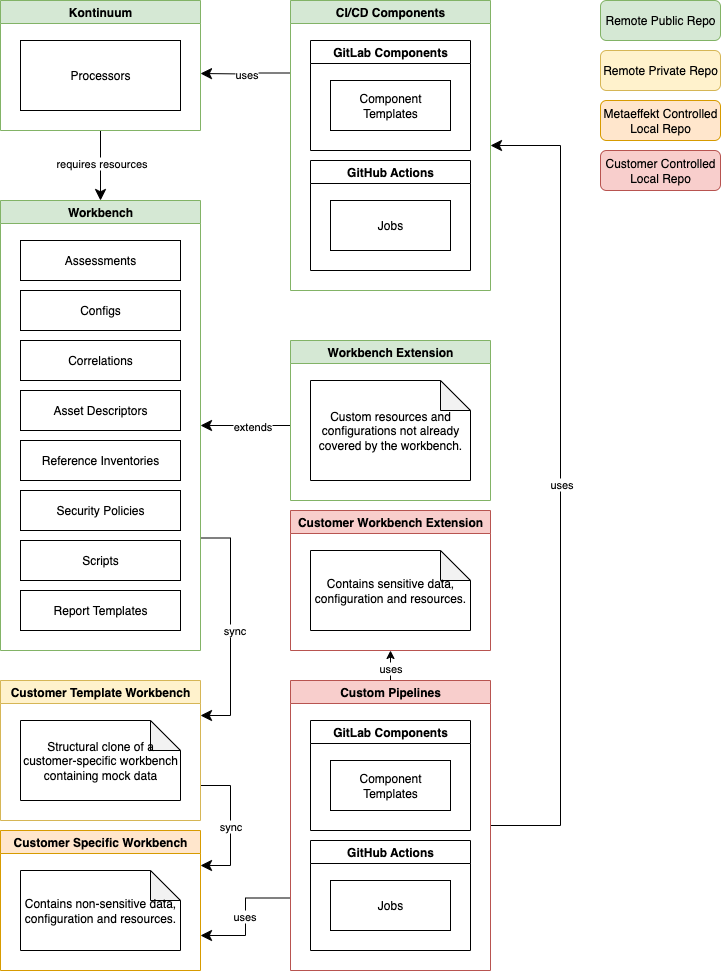

# {metaeffekt} Workbench

The metaeffekt workbench repository contains a sample workbench illustrating the integration and use of the
[metaeffekt-kontinuum](https://github.com/org-metaeffekt/metaeffekt-kontinuum). The repository is supposed to serve
as a reference and guide for custom workbench implementations. The workbench is part of a broader set of projects consisting
of the workbench itself, the [metaeffekt-kontinuum](https://github.com/org-metaeffekt/metaeffekt-kontinuum) and the
metaeffekt-workspace. In conjunction these projects enable a user to utilize the entire suite of tools, plugins and content
provided by {metaeffekt}.

## Repository Structure

The metaeffekt workbench contains several directories that are concerned with essential functionality and data.
To learn more about the function and content of each directory please refer to the respective `README.md` files:

- [`correlations`](./correlations/README.md) - Correlation data used for downstream tasks like inventory processing.
- [`descriptors`](./descriptors/README.md) - Asset descriptors used as structural blueprints and execution plans for document generation.
- [`inventories`](./inventories/README.md) - Inventories used throughout the workbench as reference or as processing input.
- [`policies`](./policies/security-policy/security-policy.md) - Security policies used throughout the workbench.
- [`scripts`](./scripts/README.md) - Scripts used in product pipelines for processing and transforming inventories.
- [`templates`](./templates/README.md) - The template encapsulating the document generation process.
- [`tests`](./tests/README.md) - Several tests for entire product pipelines.

## Project Overview

The [{metæffekt} kontinuum](https://github.com/org-metaeffekt/metaeffekt-kontinuum) provides an interface to execute 
{metæffekt} plugins and tools. The necessary resources and configurations are deposited in the {metæffekt} workbench
which, depending on the information contained
within, can either be public / private on a remote repository such as GitHub or privately hosted at {metæffekt}.
Any additional requirements not covered by the workbench will be contained in a workbench-extension project, which
can be a locally hosted customer controlled repository.

To execute different workflows CI/CD components have been made available for use with GitLab pipelines and / or
GitHub workflows. An example of how to use these components can be seen at [metaeffekt-gitlab-examples](https://gitlab.opencode.de/metaeffekt/metaeffekt-examples)

Generally speaking any templates or examples created by {metæffekt} meant as a reference for custom projects will be
available in a public repository while other data is stored increasingly more private and secure, depending on
the nature of the data.